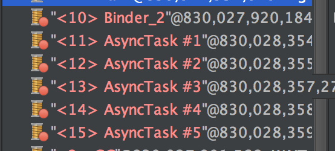

## 你真的了解AsyncTask?

虽说现在做网络请求有了Volley全家桶和OkHttp这样好用的库，但是在处理其他后台任务以及与UI交互上，还是需要用到AsyncTask。但是你真的了解AsyncTask吗？

AsyncTask的实现几经修改，因此在不同版本的Android系统上表现各异；我相信，任何一个用户量上千万的产品绝对不会在代码里面使用系统原生的AsynTask，因为它蛋疼的兼容性以及极高的崩溃率实在让人不敢恭维。本文将带你了解AsyncTask背后的原理，并给出一个久经考验的AsyncTask修改版。

## AsyncTask是什么？

AsyncTask到底是什么呢？很简单，**它不过是对线程池和Handler的封装**；用线程池来处理后台任务，用Handler来处理与UI的交互。线程池使用的是`Executor`接口，我们先了解一下线程池的特性。

## 线程池ThreadPoolExecutor

JDK5带来的一大改进就是Java的并发能力，它提供了三种并发武器：并发框架Executor，并发集合类型如ConcurrentHashMap，并发控制类如CountDownLatch等；圣经《Effective Java》也说，尽量使用Exector而不是直接用Thread类进行并发编程。

AsyncTask内部也使用了线程池处理并发；线程池通过`ThreadPoolExector`类构造，这个构造函数参数比较多，它允许开发者对线程池进行定制，我们先看看这每个参数是什么意思，然后看看Android是以何种方式定制的。

ThreadPoolExecutor的其他构造函数最终都会调用如下的构造函数完成对象创建工作：

```java
public ThreadPoolExecutor(int corePoolSize,
                          int maximumPoolSize,
                          long keepAliveTime,
                          TimeUnit unit,
                          BlockingQueue<Runnable> workQueue,
                          ThreadFactory threadFactory,
                          RejectedExecutionHandler handler)
```

- corePoolSize: 核心线程数目，即使线程池没有任务，核心线程也不会终止（除非设置了allowCoreThreadTimeOut参数）可以理解为“常驻线程”
- maximumPoolSize: 线程池中允许的最大线程数目；一般来说，线程越多，线程调度开销越大；因此一般都有这个限制。
- keepAliveTime: 当线程池中的线程数目比核心线程多的时候，如果超过这个keepAliveTime的时间，多余的线程会被回收；这些与核心线程相对的线程通常被称为缓存线程
- unit: keepAliveTime的时间单位
- workQueue: 任务执行前保存任务的队列；这个队列仅保存由execute提交的Runnable任务
- threadFactory: 用来构造线程池的工厂；一般都是使用默认的；
- handler: 当线程池由于线程数目和队列限制而导致后续任务阻塞的时候，线程池的处理方式。

那么，当一个新的任务到达的时候，线程池中的线程是如何调度的呢？（别慌，讲这么一大段线程池的知识，是为了理解AsyncTask；Be Patient）

1. 如果线程池中线程的数目少于corePoolSize，就算线程池中有其他的没事做的核心线程，线程池还是会重新创建一个核心线程；直到核心线程数目到达corePoolSize（常驻线程就位）
2. 如果线程池中线程的数目大于或者等于corePoolSize，但是工作队列workQueue没有满，那么新的任务会放在队列workQueue中，按照FIFO的原则依次等待执行；（当有核心线程处理完任务空闲出来后，会检查这个工作队列然后取出任务默默执行去）
3. 如果线程池中线程数目大于等于corePoolSize，并且工作队列workQueue满了，但是总线程数目小于maximumPoolSize，那么直接创建一个线程处理被添加的任务。
4. 如果工作队列满了，并且线程池中线程的数目到达了最大数目maximumPoolSize，那么就会用最后一个构造参数`handler`处理；**默认的处理方式是直接丢掉任务，然后抛出一个异常。**

总结起来，也即是说，当有新的任务要处理时，**先看线程池中的线程数量是否大于 corePoolSize，再看缓冲队列 workQueue 是否满，最后看线程池中的线程数量是否大于 maximumPoolSize**。另外，当线程池中的线程数量大于 corePoolSize 时，如果里面有线程的空闲时间超过了 keepAliveTime，就将其移除线程池，这样，可以动态地调整线程池中线程的数量。

我们以API 22为例，看一看AsyncTask里面的线程池是以什么参数构造的；AsyncTask里面有“两个”线程池；一个`THREAD_POOL_EXECUTOR`一个`SERIAL_EXECUTOR`；之所以打引号，是因为其实`SERIAL_EXECUTOR`也使用`THREAD_POOL_EXECUTOR`实现的，只不过加了一个队列弄成了串行而已，那么这个`THREAD_POOL_EXECUTOR`是如何构造的呢？

```java
private static final int CORE_POOL_SIZE = CPU_COUNT + 1;
private static final int MAXIMUM_POOL_SIZE = CPU_COUNT * 2 + 1;
private static final int KEEP_ALIVE = 1;
private static final BlockingQueue<Runnable> sPoolWorkQueue =
            new LinkedBlockingQueue<Runnable>(128);
            
public static final Executor THREAD_POOL_EXECUTOR
            = new ThreadPoolExecutor(CORE_POOL_SIZE, MAXIMUM_POOL_SIZE, KEEP_ALIVE,
                    TimeUnit.SECONDS, sPoolWorkQueue, sThreadFactory);
```

可以看到，AsyncTask里面线程池是一个核心线程数为`CPU + 1`，最大线程数为`CPU * 2 + 1`，工作队列长度为**128**的线程池；并且没有传递`handler`参数，那么使用的就是默认的Handler（拒绝执行).

那么问题来了：

1. 如果任务过多，那么超过了工作队列以及线程数目的限制导致这个线程池发生阻塞，那么悲剧发生，默认的处理方式会直接抛出一个异常导致进程挂掉。假设你自己写一个异步图片加载的框架，然后用AsyncTask实现的话，当你快速滑动ListView的时候很容易发生这种异常；这也是为什么各大ImageLoader都是自己写线程池和Handlder的原因。
2. 这个线程池是一个静态变量；那么在同一个进程之内，所有地方使用到的AsyncTask默认构造函数构造出来的AsyncTask都使用的是同一个线程池，如果App模块比较多并且不加控制的话，很容易满足第一条的崩溃条件；如果你不幸在不同的AsyncTask的doInBackgroud里面访问了共享资源，那么就会发生各种并发编程问题。
3. 在AsyncTask全部执行完毕之后，进程中还是会常驻corePoolSize个线程；在Android 4.4 （API 19）以下，这个corePoolSize是hardcode的，数值是5；API 19改成了`cpu + 1`；也就是说，在Android 4.4以前；如果你执行了超过五个AsyncTask；然后啥也不干了，进程中还是会有5个AsyncTask线程；不信，你看：



### Handler

AsyncTask里面的handler很简单，如下（API 22代码）：

```java
private static final InternalHandler sHandler = new InternalHandler();

public InternalHandler() {
    super(Looper.getMainLooper());
}
```

注意，这里直接用的主线程的Looper；如果去看API 22以下的代码，会发现它没有这个构造函数，而是使用默认的；默认情况下，Handler会使用当前线程的Looper，如果你的AsyncTask是在子线程创建的，那么很不幸，你的`onPreExecute`和`onPostExecute`并非在UI线程执行，而是被Handler post到创建它的那个线程执行；如果你在这两个线程更新了UI，那么直接导致崩溃。这也是大家口口相传的**AsyncTask必须在主线程创建**的原因。

另外，AsyncTask里面的这个Handler是一个静态变量，也就是说它是在类加载的时候创建的；如果在你的APP进程里面，以前从来没有使用过AsyncTask，然后在子线程使用AsyncTask的相关变量，那么导致静态Handler初始化，如果在API 16以下，那么会出现上面同样的问题；这就是**AsyncTask必须在主线程初始化** 的原因。

事实上，在Android 4.1(API 16)以后，在APP主线程ActivityThread的main函数里面，直接调用了`AscynTask.init`函数确保这个类是在主线程初始化的；另外，init这个函数里面获取了`InternalHandler`的Looper，由于是在主线程执行的，因此，AsyncTask的Handler用的也是主线程的Looper。这个问题从而得到彻底的解决。

## AsyncTask是并行执行的吗？

现在知道AsyncTask内部有一个线程池，那么派发给AsyncTask的任务是并行执行的吗？

答案是不确定。在Android 1.5刚引入的时候，AsyncTask的`execute`是串行执行的；到了Android 1.6直到Android 2.3.2，又被修改为并行执行了，这个执行任务的线程池就是`THREAD_POOL_EXECUTOR`，因此在一个进程内，所有的AsyncTask都是并行执行的；但是在Android 3.0以后，如果你使用`execute`函数直接执行AsyncTask，那么**这些任务是串行执行的**；（你说蛋疼不）源代码如下：

```java
public final AsyncTask<Params, Progress, Result> execute(Params... params) {
    return executeOnExecutor(sDefaultExecutor, params);
}
```

这个`sDefaultExecutor`就是用来执行任务的线程池，那么它的值是什么呢？继续看代码：

```java
private static volatile Executor sDefaultExecutor = SERIAL_EXECUTOR;
```

因此结论就来了：**Android 3.0以上，AsyncTask默认并不是并行执行的**；

### 为什么默认不并行执行？

也许你不理解，为什么AsyncTask默认把它设计为串行执行的呢？

由于一个进程内所有的AsyncTask都是使用的同一个线程池执行任务；如果同时有几个AsyncTask一起并行执行的话，恰好AysncTask的使用者在`doInbackgroud`里面访问了相同的资源，但是自己没有处理同步问题；那么就有可能导致灾难性的后果！

由于开发者通常不会意识到需要对他们创建的所有的AsyncTask对象里面的`doInbackgroud`做同步处理，因此，API的设计者为了避免这种无意中访问并发资源的问题，干脆把这个API设置为默认所有串行执行的了。如果你明确知道自己需要并行处理任务，那么你需要使用`executeOnExecutor(Executor exec,Params... params)`这个函数来指定你用来执行任务的线程池，同时为自己的行为负责。（处理同步问题）

实际上《Effective Java》里面有一条原则说的就是这种情况：不要在同步块里面调用不可信的外来函数。这里明显违背了这个原则：AsyncTask这个类并不知道使用者会在`doInBackgroud`这个函数里面做什么，但是对它的行为做了某种假设。

### 如何让AsyncTask并行执行？

正如上面所说，如果你确定自己做好了同步处理，或者你没有在不同的AsyncTask里面访问共享资源，需要AsyncTask能够并行处理任务的话，你可以用带有两个参数的`executeOnExecutor`执行任务：

```java
new AsyncTask<Void, Void, Vo
    @Override
    protected Void doInBackground(Void... params) {
        // do something
        return null;
    }
}.executeOnExecutor(AsyncTask.THREAD_POOL_EXECUTOR);
```

## 更好的AsyncTask

从上面的分析得知，AsyncTask有如下问题：

1. 默认的AsyncTask如果处理的任务过多，会导致程序直接崩溃；
2. AsyncTask类必须在主线程初始化，必须在主线程创建，不然在API 16以下很大概率崩溃。
3. 如果你曾经使用过AsyncTask，以后不用了；在Android 4.4以下，进程内也默认有5个AsyncTask线程；在Android 4.4以上，默认有`CPU + 1`个线程。
4. Android 3.0以上的AsyncTask默认是串行执行任务的；如果要并行执行需要调用低版本没有的API，处理麻烦。

因此我们对系统的AsyncTask做了一些修改，在不同Android版本提供一致的行为，并且提高了使用此类的安全性，主要改动如下：

1. 添加对于任务过多导致崩溃的异常保护；在这里进行必要的数据统计上报工作；如果出现这个问题，说明AsyncTask不适合这种场景了，需要考虑重构；
2. 移植API 22对于Handler的处理；这样就算在线程创建异步任务，也不会有任何问题；
3. 提供串行执行和并行执行的`execute`方法；默认串行执行，如果明确知道自己在干什么，可以使用`executeParallel`并行执行。
4. 在`doInbackgroud`里面频繁崩溃的地方加上`try..catch`；自己处理数据上报工作。

完整代码见gist，[BetterAsyncTask](https://gist.github.com/tiann/8860bcc514f067ab4291)

> 原文地址：http://weishu.me/2016/01/18/dive-into-asynctask/